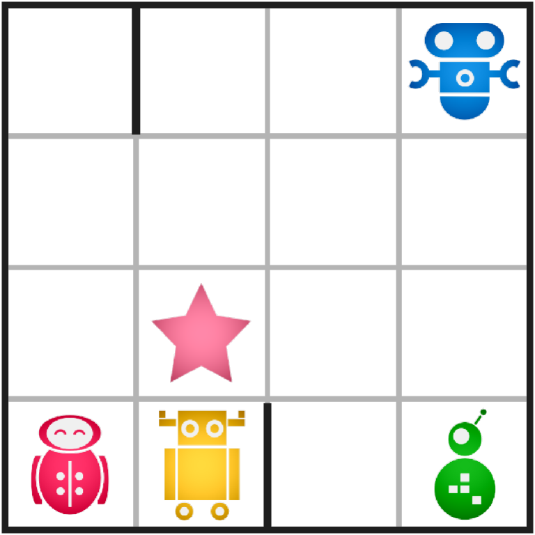

# Ricochet Robots

## How to Run the project
`python3 ricochet_robots.py {input_board}`

Note that there are input boards in `boards/` that you can use to test the code.

## Project Details

This project is a program made in Python to solve the  puzzle game [Ricochet-Robots](https://en.wikipedia.org/wiki/Ricochet_Robot) in the least amount of plays possible in the quickest time. **Ricochet Robots** is a puzzle game played on an NxN grid. Each cell of the grid may have barriers on any of its four edges (top, bottom, left, or right). The outer boundary of the board also has barriers by default, preventing robots from leaving the grid.

We have **four robots**, each in a unique color (**Red**, **Yellow**, **Green**, **Blue**), and exactly **one target** placed somewhere on the board. The target is tied to the color of one of the robots (e.g., if the target is Red, you must move the Red robot onto that cell).

### Movement Rules

1. **Valid moves** are strictly in the four orthogonal directions: **up**, **down**, **left**, or **right**.
2. Once a robot starts moving in a chosen direction, it continues until it collides with either:
   - a **barrier**, or
   - another **robot**.
3. Robots cannot pass through each other or share a cell.

### Objective

The goal is to find a **sequence of moves** that leads the robot (matching the target’s color) to the target cell. Each move is described as a robot color plus a direction (one of up/down/left/right), and the robot will move until it is forced to stop.

An input file describes one puzzle instance as follows:

1. A single integer \(N\), the size of the \(N \times N\) board.
2. **Four lines** for the starting positions of the four robots. Each line has:
   - A capital letter (**R**, **Y**, **G**, or **B**).
   - Two integers \(i\), \(j\) (with \(1 \le i, j \le N\)) for the robot’s row and column.
3. **One line** specifying the target color and position (again, one capital letter and two integers).
4. A single integer \(K\) for how many **internal barriers** exist.
5. **\(K\) lines**, each describing a barrier. Each has:
   - Two integers \(i\), \(j\) for the cell position.
   - A direction (**u**, **d**, **l**, or **r**) indicating where the barrier is located on that cell’s edge.

Example of an input file (for a 4x4 board):

4\
Y 4 2\
G 4 4\
B 1 4\
R 4 1\
R 3 2\
2\
1 1 r\
4 2 r

## Output Format

A solution is a list of moves that leads the correct robot onto the target cell. The output format is:

1. A single integer \(M\), the number of moves.
2. **\(M\) lines**, each describing a move. Each line contains:
   - A robot color letter (**R**, **Y**, **G**, or **B**).
   - A lowercase letter for the move direction (**u**, **d**, **l**, **r**).

For example:

4\
B l\
Y u\
R r\
R u

That means:
1. Move **Blue** robot **left**.
2. Move **Yellow** robot **up**.
3. Move **Red** robot **right**.
4. Move **Red** robot **up**, ending on the target cell.

## Internal Structure and Search Algorithm
This project consists of a program that builds a structure that will store the board and its' components (Robots and Walls), and will search the solution in a search tree using a given algorithm. To reach the best solution, various algorithms were tested and the results concluded that the best algorithm for this problem was the RBFS (Recursive Best First Search). However the project author's are aware that there can be a better solution using a better heuristic with more information, in which other algorithms would performe better over the RBFS, that has some limitations. For instance, with a quality heuristic the A* algorithm would perform better than the RBFS, having a low branching factor.
